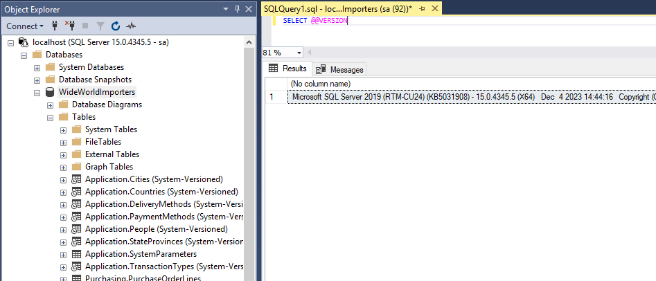
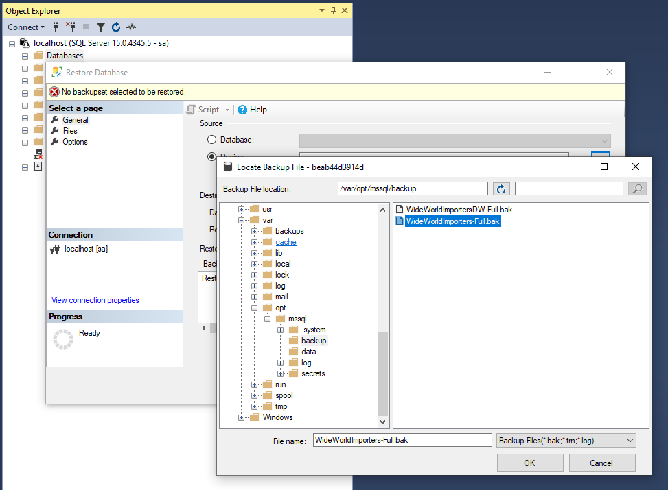
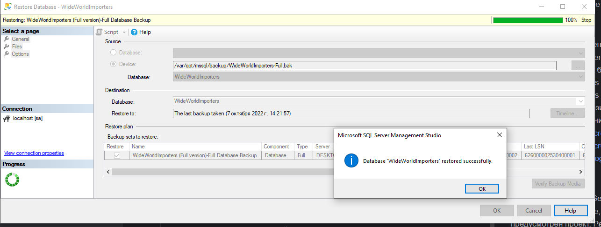

### Результат



<hr>

### Реализация ДЗ (в контейнере)

На основе [инструкции Microsoft](https://learn.microsoft.com/ru-ru/sql/linux/tutorial-restore-backup-in-sql-server-container?view=sql-server-ver16&tabs=prod)

скачивание образа

```bash
docker pull mcr.microsoft.com/mssql/server:2019-latest
```

запуск контейнера

```bash
docker run -e 'ACCEPT_EULA=Y' -e 'MSSQL_SA_PASSWORD=Otus202402' --name 'OTUSSQL' -p 1433:1433 -v sql1data:/var/opt/mssql -d mcr.microsoft.com/mssql/server:2019-latest
```


перенос резервной копии в контейнер

```bash
docker exec -it OTUSSQL mkdir /var/opt/mssql/backup
docker cp WideWorldImporters-Full.bak OTUSSQL:/var/opt/mssql/backup
docker cp WideWorldImportersDW-Full.bak OTUSSQL:/var/opt/mssql/backup
```

```
```
база восстановлена успешно:



